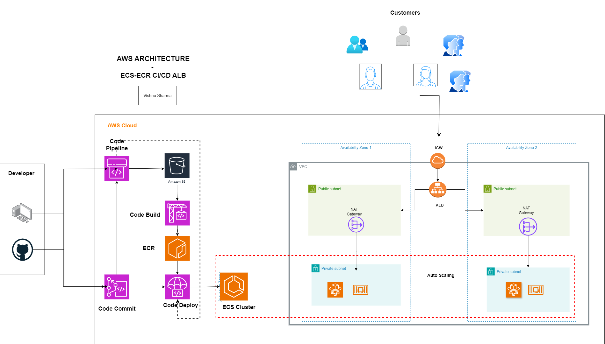

# AWS-Architecture-  ECR-ECS CICD
Launching Complete AWS Architecture made easy using Terraform.

## Architecture Diagram


## Resources
- AWS Account
- Terraform as IaC
- GitHub for code hosting
- Application Packages and Dockerfile

## Introduction
This is an intricate, automatic, highly secure and highly available AWS Architecture. I have created this amazing architecture and made the implementation very easy using Terraform. In this project, we have hosted the application running in AWS as a Elastic Container Service - Fargate. The application is hosted in fargate by making serverless and cost optimization. The application is made Highly Available using load balancer in 2 AZs with Autoscaling, and is Highly Secure by hosting it in Private subnets. Lastly, The app is deployed automatically by AWS CI/CD Pipeline. 

## Repo
In this Repository, 
1. Terraform folder - contains descriptive codes for implementating resources in AWS
2. README.md file
3. time-off_Architecture.drawio.png file - AWS Architecture Diagram


## Code and Instruction
### Pre-Requisites
1. AWS Account - AWS User Permissions with appropriate permissions like AmazonEC2ContainerRegistryFullAccess.
2. Terraform
3. Git-Hub Account
4. builspec.yml for Code Build

## Instructions
1. **Create ECR**
   - From _main.tf_ in the above Terraform folder, comment /* vpc and ecs */ modules code and run commands:
   ```sh
   terraform init
   terraform plan
   ```
   - Make sure that only one resource (ECR) is being created and do terraform apply.
   ```sh
   terraform apply
   ```
    This step is important because after we push docker image into ecr, we are using ecr url from the output.tf as the variable for ecs creation.
2. **Push Docker Image into ECR**
   - ssh into an EC2 Instance, I created a simple **nodejs-ssl-server Application** with Installation Instruction in **Nodejs-server Repository (https://github.com/VishnuSharma11D00/Nodejs-server.git)**
   - Git clone the Nodejs-server link and simply copy-paste "view push commands" from ECR page in the aws console.
   - These commands will build a Docker Image and Push into your ECR repository.

3. **Create VPC, ECS, ALB**
   - Now once the ECR is created, it's url is used as a variable to create ECS.
   - Launch Infrastructure:
   ```sh
   terraform plan      #check before applying
   ```
   ```sh
   terraform apply
   ```
   This may take some time to execute.

After the Infrastructure is launched you can access the application from **load balancer https url**.

4. **CI/CD Pipeline**
   - Now go to AWS Code Pipeline in the console and create a pipeline:
   - Source -
     - GitHub. Attach github account and the link of your application repository. In my case, I used the one that I mentioned above (https://github.com/VishnuSharma11D00/Nodejs-server.git)

   - CodeBuild -
     - In Code Build page in console, create new project. Source: Git-Hub
     -  Upload your **BUILDSPEC YAML** file, I have provided _buildspec.yml_ file to make your process easier.
     - Select this a build provider in the CodePipeline.
     - Add the variables according to the app.js file in the Nodejs-server Repository.

   - Deploy -
     - Use the ECS as deploy provider. Create Pipeline.
     - This may take a while to execute.
   Now you can edit _app.js_ file in the github which will trigger the Pipeline to start processing.

## Output
After the successful execution of CodePipeline, the website should update automatically upon reloading.
We have configured Fully automated AWS Architecture in few simple steps. 
 #### **Congrats! Now your web application with CI/CD Pipeline configuration is complete.**
 
Note: These Terraform modules can also be used in different AWS projects which makes your job easier.

# Terminate
- This is the crucial part of this project to save costs, Delete Code Pipeline and Code Build project from Console. Now go to Terraform terminal and run:
  ```sh
  terraform destroy
  ```
- This will destroy all the resources that were launched, saving the time and work for you.
- Once again, implementing the resources using terraform has made the job easy.

# Customization 
### Use EFS with Fargate
  - Amazon Elastic File System (Amazon EFS) provides simple, scalable file storage for use with your Amazon ECS tasks. With Amazon EFS, storage capacity is elastic. It grows and shrinks automatically as you add and remove files. Your applications can have the storage they need and when they need it. 

### Application Security
   - customize Security groups and NACL rules accordingly. These are very crucial to protect your application.
   - 
### Using WAF on top of load balancer:
  - Adding a Web Application Firewall helps protect web applications by filtering and monitoring HTTP traffic between a web application and the Internet.

### Adding more AZs for HA:
  - I have made the Terraform code very easy to understand and update. You can just edit the vpc.tf in vpc module by adding more AZs and updating the resources accordingly.

### DynamoDB for Database service
  - Since we are hosting application in ECS Fargate, use DynamoDB to make this a complete serverless architecture.

# Feedback
Please report any issues or feedback to vishnusharma11d00@gmail.com
